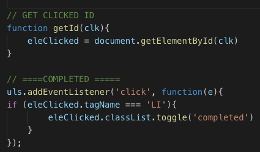

<h1>TODO LIST</h1>

I did this project as a part of assignment in DigitalCraft to learn DOM manipulation.
I have created todo List with jQuery before at Udemy Course, so the challenge this time was DOM manipulation.

<h3>My Challenge</h3>
My biggest challenge was to find out how to pass clicked element information when there are more than 1 element. I spent good few hours researching and also asked my class TA. I have decided to add id to each applicable element and completed this project.

<h5>Code Snippet</h5>
